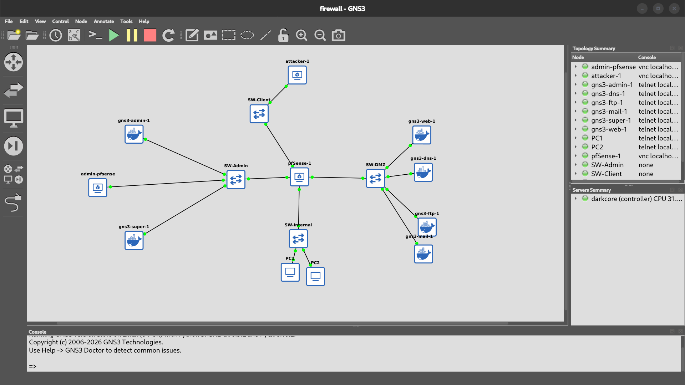
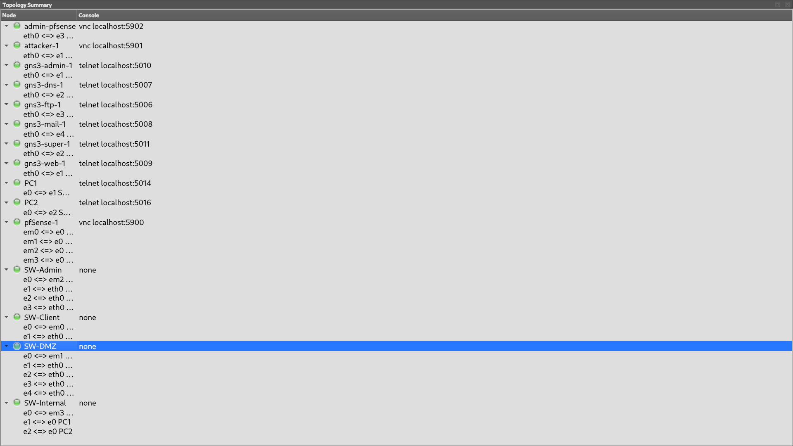
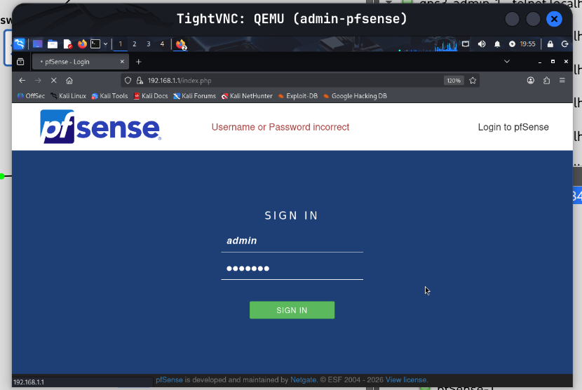
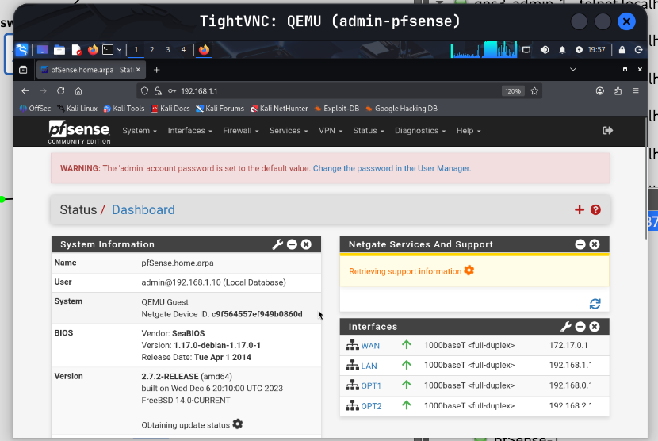

# Firewalling Lab with pfSense (GNS3 + Docker)

## Overview

This project implements a firewalling lab using pfSense within a GNS3 environment. Docker containers are used to simulate hosts and services distributed across multiple network segments.

The purpose of this lab is to design a segmented network architecture and prepare it for firewall configuration, NAT, and controlled service exposure.

At this stage, the repository documents the architecture and initial deployment. Firewall rules and NAT are not yet implemented.

---

## Topology

### Main Topology

### Simplified Topology

---

## Network Architecture

The network is divided into four segments connected through pfSense.

### WAN / Client Network
- Network: `172.17.0.0/24`
- Role: untrusted external network
- Interface: `em0`
- pfSense IP: `172.17.0.1`

### DMZ
- Network: `192.168.0.0/24`
- Role: service zone
- Interface: `em1`
- pfSense IP: `192.168.0.1`

### Administration Network
- Network: `192.168.1.0/24`
- Role: management and supervision
- Interface: `em2`
- pfSense IP: `192.168.1.1`

### Internal Network
- Network: `192.168.2.0/24`
- Role: trusted internal hosts
- Interface: `em3`
- pfSense IP: `192.168.2.1`

---

## pfSense Interfaces

| Interface | Zone | IP Address |
|----------|------|------------|
| em0 | WAN | 172.17.0.1/24 |
| em1 | DMZ | 192.168.0.1/24 |
| em2 | Administration | 192.168.1.1/24 |
| em3 | Internal | 192.168.2.1/24 |

---

## Services and Hosts

### Administration Network
- admin-pfsense: workstation used to access the pfSense WebGUI
- supervision: monitoring node

### DMZ
- ftp: file transfer service
- web: web service
- mail: mail service
- dns: DNS service

### WAN
- attacker-1: external client used for testing

### Internal Network
- PC1, PC2: internal hosts

---

## Security Model

The architecture is based on network segmentation:

- WAN is considered untrusted
- DMZ hosts services that may be exposed externally
- Administration network is used for management access
- Internal network contains protected systems

This structure prepares the environment for later implementation of:
- firewall filtering rules
- NAT and port forwarding
- access control between zones
- service exposure policies

---

## pfSense Web Interface

### Login Page

### Dashboard

Access is performed from the administration network using:
https://192.168.1.1

## GNS3 Project

The file `gns3/firewall.gns3` contains the full topology of the lab.

To use it:

1. Open GNS3
2. Import or open the `.gns3` file
3. Ensure required images/templates (pfSense, Docker nodes) are available
4. Start the topology

Note: container images and system images are not included in this repository.